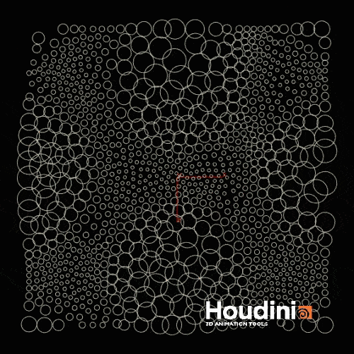
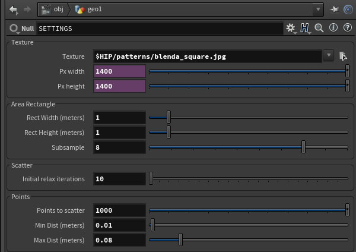

## This repo is to share SideFX Houdini scene setups I figured out on my way learning the software.
---

## C isolines (2017.12.06):
##### [Click to download _C_isolines_001.hipnc_](C_isolines_001.hipnc)
My Render: | Uploaded .hipnc file render:
------------ | -------------
 Click for high quality! | 

## D (2017.12.14):
##### [Click to download _D_001.hipnc_](D_001.hipnc)
My Render: | Uploaded .hipnc file render:
------------ | -------------
 Click for high quality! | 

## hou7 (2018.04.24):
##### [Click to download _hou7_001.hipnc_](hou7_001.hipnc)
Result: | Map: | Settings:
------------ | ------------- | -------------
setup A:
------------ | ------------- | -------------
 |  |  

