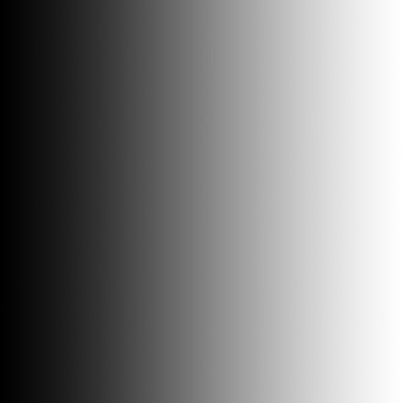
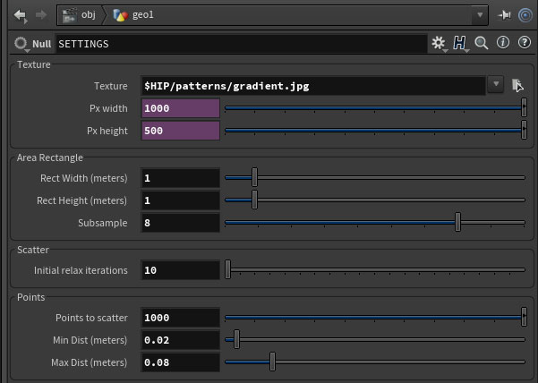

## This repo is to share SideFX Houdini scene setups I figured out on my way learning the software.
---

## C isolines (2017.12.06):
##### [Download C_isolines_001.hipnc   (Right click -> Save As)](C_isolines_001.hipnc)
My Render: | Uploaded .hipnc file render:
------------ | -------------
 Click for high quality! | 

## D (2017.12.14):
##### [Download D_001.hipnc   (Right click -> Save As)](D_001.hipnc)
My Render: | Uploaded .hipnc file render:
------------ | -------------
 Click for high quality! | 

## hou7 (2018.04.24):
##### [Download hou7_001.hipnc   (Right click -> Save As)](hou7_001.hipnc)
Map: | Settings: | Result:
------------ | ------------- | -------------
setup A:
 |  | 
setup B:
 |  | 

